# Mohammed - Battleships

## Challenge Outline
I was tasked with designing, developing and testing a take on the classic Battleships game.
The idea was to allow a player to play against a CPU in accordance with the normal game rules.

### Game Mechanics

### Objective: 
Sink all of the opponent’s ships before they sink yours.

### Gameplay
Players will arrange their ships on the board horizontally or vertically and without any overlap. 
Players will take turns to fire missiles at a specified coordinate on the opponent’s board (e.g., B2) with the intention to hit an enemy ship. 
The attacking player will be notified whether it was a hit or miss. The game is won when one player has destroyed all the opposing ships completely.

My rendition includes:

* The simultaneous display of both the player’s and enemy’s boards
* Turn taking mechanism - boards are updated with each valid attack
* Error handling to deal with inappropriate user inputs
* Win/Loss/Tie detection and display
* The ability to quit at any time

### Initial Design

As I could forsee my game having a number of unique objects similar to the original game, I opted for an OOP approach to the game.
The objects I initially planned for are listed below:
* Board
* Ship
* Player
* Game

Early on, this 'player' class was separated into a PlayerHandler and CPUHandler. Each would inherit from an abstract base class called GameHandler that represents an entity that can take turns in the game.
I felt this separation of concerns simplified each handler rather than having one monoloth of a player class with all the player logic.

Additionally, I also decided to further decompose the Board into its constituent Board Tiles.
Each tile would store information about whether the tile is empty, hit or being occupied by a ship. The board itself would be a 2D-vector of Tile objects.
Thus, allowing the board class to keep track of each tile's state.

The UML diagram below depicts the archictectural approach I took:

_UML Diagram_

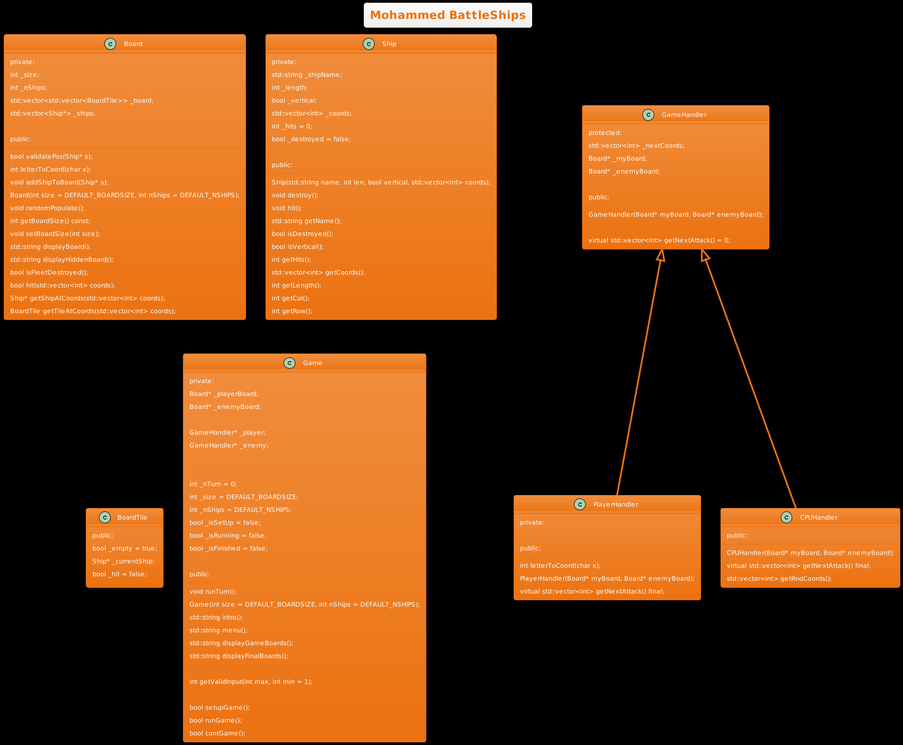

## Development

### Agile Approach

Due to the complexity of the challenge coupled with the time constraint, I broke the problem down into a series of manageable phases that I would develop to iteratively reach a 'final' game.
This helped a lot because the challenge was so new to me and it was difficult to ascertain how feasible my proposed features were and how long they would take. Through this approach, the task seemed less
daunting and I was able to tackle each challenge as it came.

Each iteration was defined by its requirements and was then designed, developed and tested in due course.
For my QA process, I conducted manual testing during and after the addition of each new feature to ensure successful integration.
I made to sure to try both valid, invalid and unexpected inputs and account for them where possible.

> Phase 1

* Build a file parser that can extract board dimensions and ship data from a .ini file

> Phase 2

* Display an empty board - must be formatted and aligned
* The X-Axis should be lettered whilst the Y-Axis is numbered

Note: Game logic not required at this point in time.

> Phase 3

* Intuitive Set-Up interface to allow user to select: 
    1. Player vs CPU 
    2. Quit
* Allow user to see target board aswell as their own board showing their ship locations
* Implement working game logic
    * Allow firing at target board
    * Update boards with attack result each turn
    * Notify player of hit ('H') or miss ('M') based on the outcome of their turn
* Catch erroneous inputs
* Support in-game quitting
* Detect a win/Loss/Tie

> Final Phase

* Must fulfil all the requirements stated in phase 3
* Allow user to set board dimensions
* Allow user to choose opponent difficulty

### Decomposition - Epics

In true agile fashion, I decided to break down the major elements of development into a few key epics. I began by using JIRA to create a backlog and series of appropriate tickets.
That said, I found JIRA to be time-consuming to maintain so I transitioned to Trello soon after. As my project was relatively lightweight and I was unsure how long each task would take,
Trello seemed most appropriate as it fulfilled my need to be able to track epics and stories and view their completeness.
 
 _Trello Board_ 

 

I created a board with a number of epics corresponding to each major component within my game. Each epic had a number of smaller stories within it that outlined the criteria for completion at each stage.
This gave me clear guidelines and expectations at the end of each epic.

After defining the epics, I filled the backlog with all the potential stories that would need to be completed; these were somewhat flexible and subject to change if something became unfeasible or needed clearer explanantion.
When I was ready to start a story, I would move it to the 'In Progress' column. Each story would arise from a specific user requirement. Before regarding a story as 'Done' it would undergo QA testing to ensure it was functioning as expected
(defined in the acceptance criteria of each ticket).

_User Story Example_ 

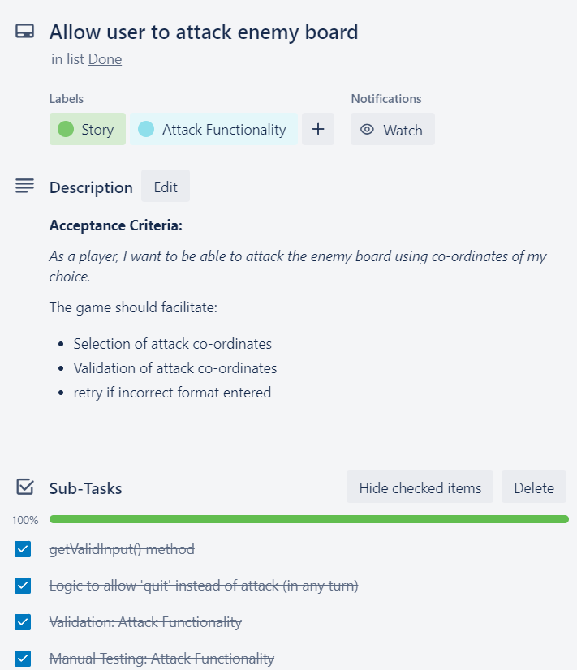

The image above shows an example user story with clearly outlined acceptance criteria. 
The labels highlight the type of ticket (e.g., story) as well as a reference to the corresponding epic (e.g., Attack Functionality).
Once all the requirements are met and the sub-tasks are complete, it is moved to the 'Done' column.

### Phase 1 - File Parser & OOP skeleton

For the initial phase of development, I put some thought towards the basic classes, properties and methods that would comprise my solution.
I began with a basic 'Board' class with a 'size' property, 2D-array of Board tiles and a vector of ships.

Meanwhile, I also began working on a fileParser method to extract board and ship data. I had an initial 'settings.h' file
with a 'ShipData' struct that I wanted to use to store parsed file data for the ships.

**_File Parser attempt #1_**

_State Machine Pattern - fileParser()_

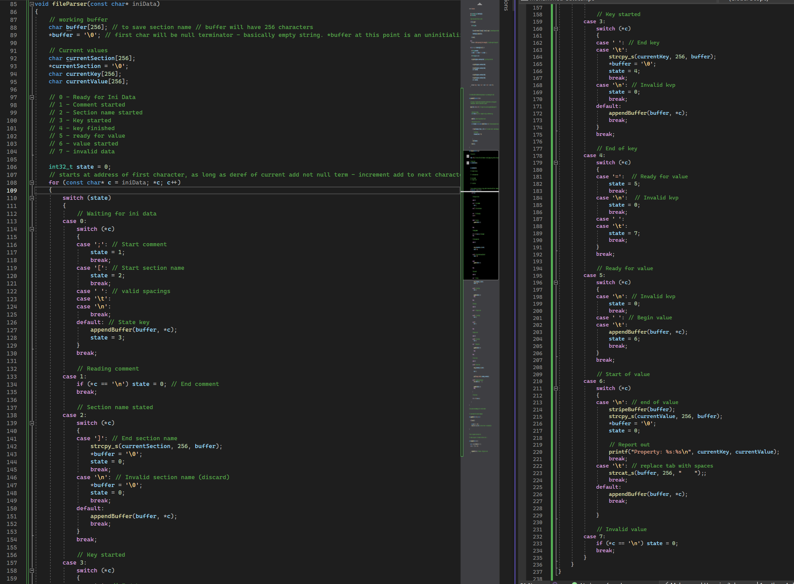

My initial attempt at file parsing utilized a number of functions used to read and parse data from an INI file.
The fileParser() method takes a string containing INI file content as an input and processes it line by line. It uses the State Machine design pattern and consists of 
a number of states (0 to 7). They are used to track the current position in the parsing process.

The 'for' loop at the end of the function iterates over each character in the 'IniData' string. The 'switch' statement inside the loop checks the current state and determines 
how to handle the current character based on that state. For example, when state is '0' (waiting for INI data), the 'switch' logic checks if the current character is a semi-colon (to
start a comment), an open square bracket (to start a section name), or a tab/new line. If the character is any other character, the state is switched to 3 (key started) and is added to the buffer.

_State Machine Pattern - parseFromFile()_

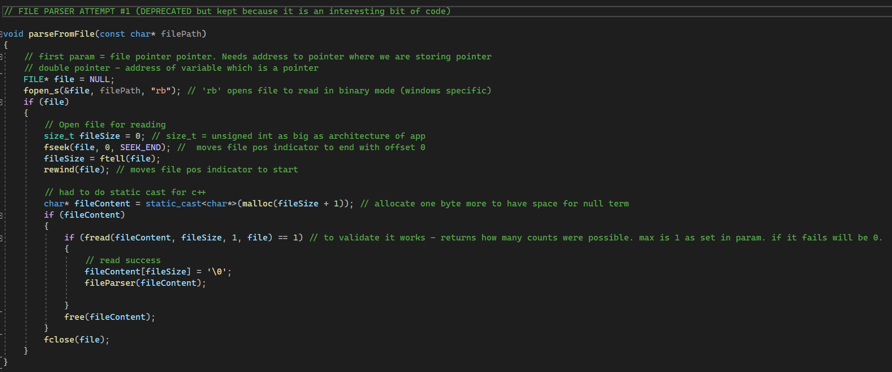

The 'parseFromFile' method takes a file path as an input, opens the file in binary read mode, reads the contents of the file into memory, and then calls the 'fileParser' method above with the file
content as an argument.

After getting the file parser to a position where I could ouput the data for the board and ships, it was a challenge trying to allocate the data to the relevant properties in the board and ship classes.
At this point, it was taking too long to solve as I was not fully familiar with the nuances of the language so I made the decision to be flexible and take a new approach.

**_File Parser attempt #2_**

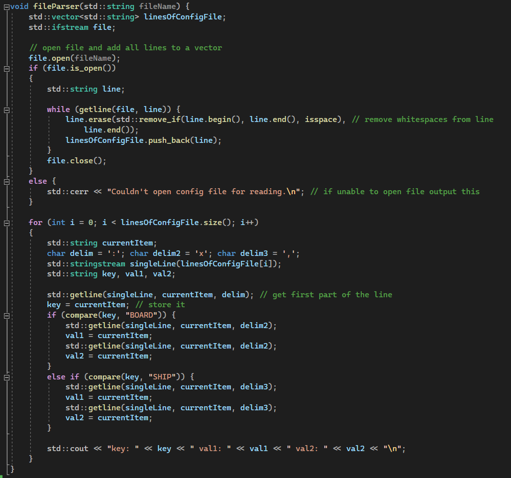

In the second attempt, I decided to reduce the complexity of the function for the time being until I had a working game (part of good programming standards). This method:
1. Takes a string 'fileName'
2. Opens the file and reads all of the lines into a vector of strings.
3. Iterates through the vector of lines and splits each line into three parts using the ':', 'x', and ',' characters as delimiters.
4. Stors the three parts in variables 'key', 'val1', and 'val2'.
5. Outputs the values of 'key', 'val1', and 'val2' to the console.

Here I got to a similar point as attempt one, where I could output the data but I felt I was putting too much emphasis on this first phase so I put this part on hold to prioritise actually rendering a board.

### Phase 2 - Rendering a Board

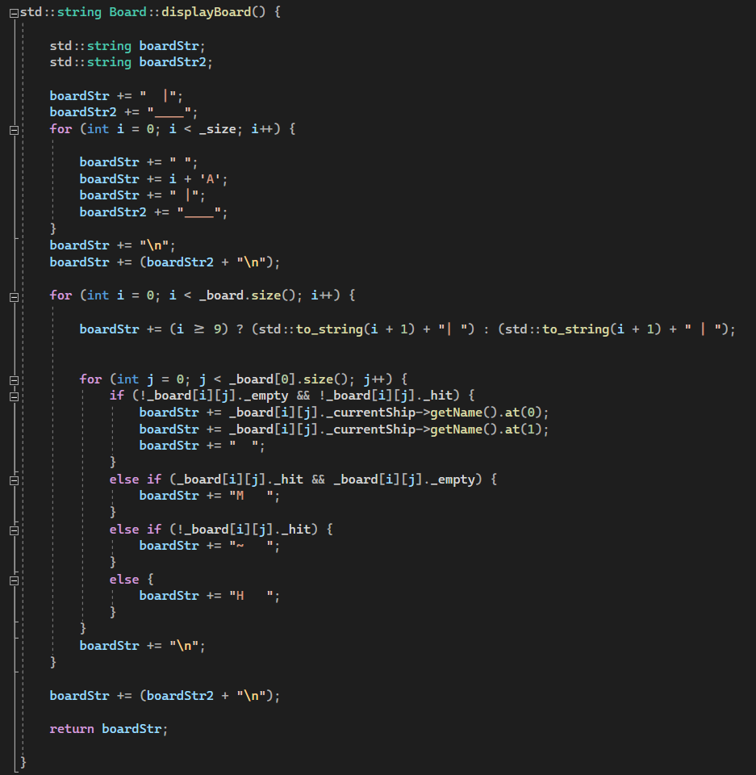

The above method is responsible for rendering the board. It returns a string interpretation of the board, showing all the ships and their positions.
It is mainly built using for loops. The main loop checks if a tile is occupied and not hit and if so, the ship name is shown. However, an empty tile that has been hit is marked by an M
and a successfully hit tile is marked 'H'.

It was tricky trying to think about how I could show the target board without giving away the board locations. To solve this,
I made another method called 'displayHiddenBoard', which shows a board with ship locations hidden, but hits and misses revealed. It is a solution that works well but I do hope to find
a better solution that reduces the repetition of code in future.

### Phase 3 - Working Game

_**Refined Board Class**_

In order to maintain good coding standards, I ensured regular and thorough testing during these stages of development. This can be seen as I have added appropriate error handling
if the given size is too large or too small.

For MVP purposes, I decided to first randomly populate the board with ships (as shown above). One challenge I had to consider is: 'what if the program takes extremely long to find a random placement?'
In this case, I ensured robustness by having a reasonable maxCount that results in an error if exceeded. This added to my game's robustness.
The ideal scenario is for this method to be a part of an autopopulate feature whilst the default would be to allow the user to place their own ships. However, due to time constraints, this could
not be implemented.

_**Validating and Adding Ships**_

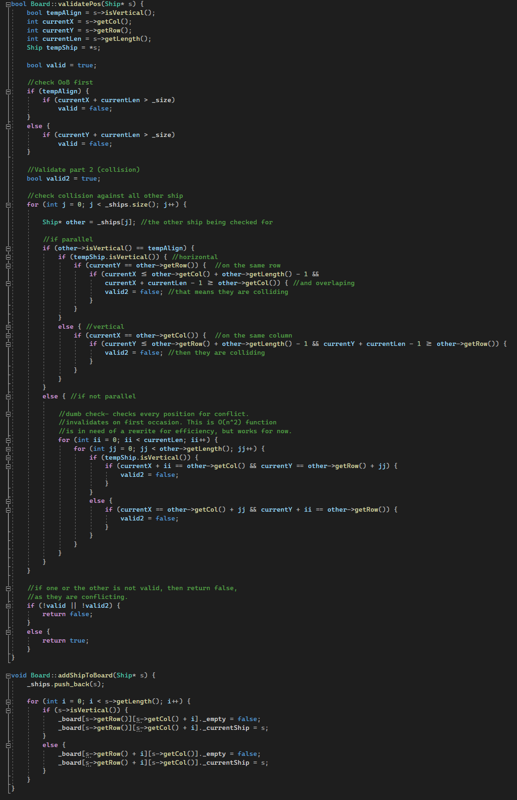

The validatePos function is responsible for checking whether or not a ship can be placed in a particular position. It checks whether the ship is within bounds and ensures it is not colliding
with another ship. One highlight is that it checks for parallel and non-parallel ships - allowing more flexibility of placement.

One challenge is that the collision detection for non-parallel ships is inefficient. The use of nested loops result in an O(n^2) time complexity. This means a significant increase in time taken
as the number of ships increase. The ship is then added (addShipToBoard) by updating the '_empty' and '_currentShip' fields of the BoardTile to reflect the presence of the ship.
I solved the inefficiency in the validatePos method by doing the following:
* Moved the check for out-of-bounds positions to the beginning of the function. This prevents unnecessary collision checks if the ship is already known to be out-of-bounds.
* Changed the nested loop that checks for collisions to only run when the ships are not parallel. This reduces the number of checks that need to be performed, since most ships will be parallel.
* Returned false as soon as a collision is detected, rather than continuing to check for more collisions.

_**The improved code can be seen below:**_
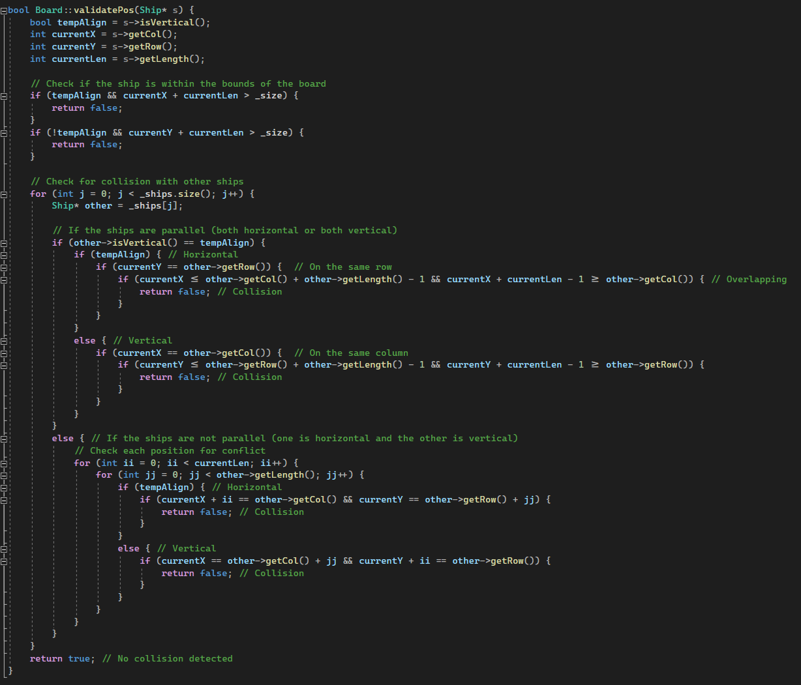

_**Get Player's Next Attack**_

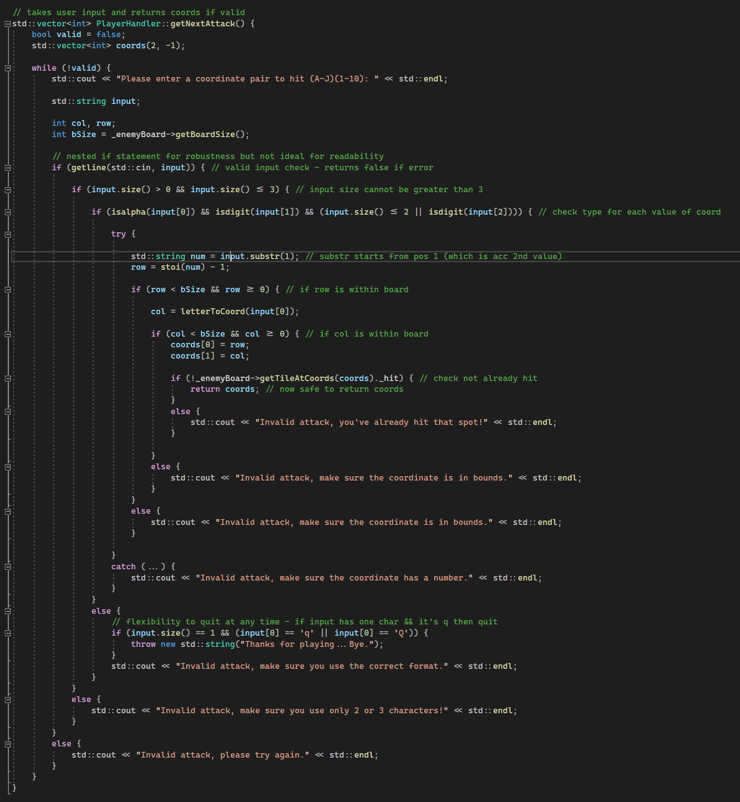

I then created a robust method that deals with a variety of inputs (good and bad) from the user in terms of attacking the enemy board.
It also allows the user flexibility to quit at any point.
However my first solution had a few challenges:

* Difficult to read due to deep nesting
* Inconsistent error handling - if stoi throws an exception, the code will catch it and print an error message, but if getline returns false, the code will simply print an error message without catching an exception. This can make the code harder to debug and maintain.
* The code uses the throw statement to quit the game, which is not a recommended way to handle quitting in C++. It would be better to use a loop control statement (such as break) or a function return value to exit the loop and the function.

_**Attempt at improved version:**_
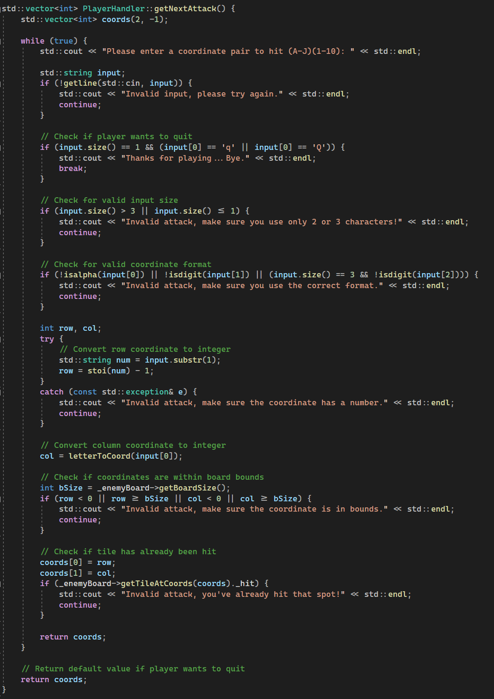

I attempted to refactor the code to improve some of these bad practices:
* Used 'while' loop and 'continue' statements to repeatedly prompt the player for a coordinate until a valid one is entered.
* Handles quitting better - using a break statement to exit the loop and the function.
* input validation checks have been simplified and made more user-friendly, and exceptions are now consistently caught and handled.
 
 The overall structure of the code is also much simpler and easier to follow.

 Although this solution is cleaner, it resulted in a minor bug when I tried to quit the program instead of attack so I reverted to the original method. I have kept the
 attempt at improvement because I believe it still has merit.

_**Getting random Attack Coords**_
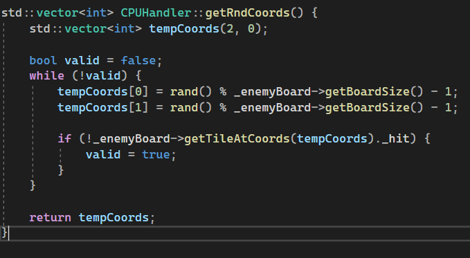

The CPUHandler is derived from the 'GameHandler' class. It has a method 'getNextAttack' which uses a helper function ('getRndCoords')
to return a random set of coords for the CPU to attack the enemy board.
My initial approach to a random CPU attack was to just keep on picking random x and y coords until
one that is not yet hit is selected. However, this did not seem very efficient because when the board is mostly hit, it would
become very time-consuming trying to find a coord that is not hit.

_**Improving random Attack Coords**_
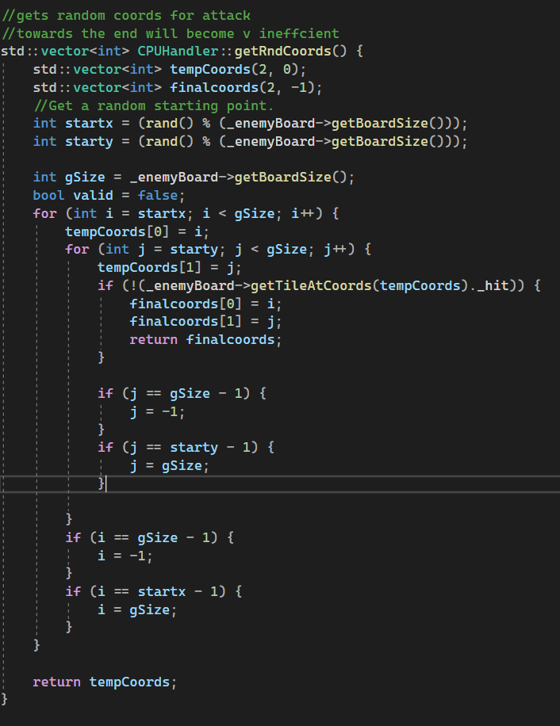

In the improved iteration, a nested loop is used to  iterate through all of the tiles on the enemy board. The outer loop is using the variable i to iterate through the rows of the board,
and the inner loop is using the variable j to iterate through the columns of the board.

This section is modifying the loop variables i and j in order to "wrap around" to the beginning of the board when the end is reached, so that the loop can continue to iterate through 
all of the tiles on the board. For example, when j reaches the last column of the board (gSize - 1), it is reset to -1 so that the inner loop will start again at the first column of the board on the next iteration. 
Similarly, when i reaches the last row of the board, it is reset to -1 so that the outer loop will start again at the first row of the board on the next iteration.
The latter part where j == starty - 1 and i == startx - 1 are similar, but they are resetting the loop variables to bSize instead of -1. This causes the loops to continue iterating until they reach the starting position again, 
rather than wrapping around to the beginning of the board.

### Final Phase - Additional features

In order to add greater flexibility for the user (as well as to increase the complexity of my game), I added two customization features in the final phase of development:

1. Ability to set board dimensions
2. Ability to set CPU difficulty

**Game Class**

Both of these are primarily controlled by the Game class.

This class represents the game itself. It has member variables for storing pointers to Board objects for the player's board and the enemy board, and pointers to GameHandler objects for the player and the enemy. 
It also has member functions for setting up the game, running the game, and displaying the game boards. It also has a 'runTurn' function which handles a single turn of the game.

The program's main function instantiates a new Game and then proceeds to keep the game running on a loop via the contGame method.
Both lines are in a try catch block in case any errors occur when trying to run it.

The 'Game' class constructor instantiates:
* Player board
* Enemy board
* Player Handler
* Enemy Handler

The contGame() method keeps the game running until it enters a finished state.
If the game is not finished, the game first enters setup mode. Here the user can select a menu option to proceed with:

1. Player Vs CPU
2. Set Board Dimensions
3. Set Difficulty
4. Quit

_**Setting Board Dimensions**_
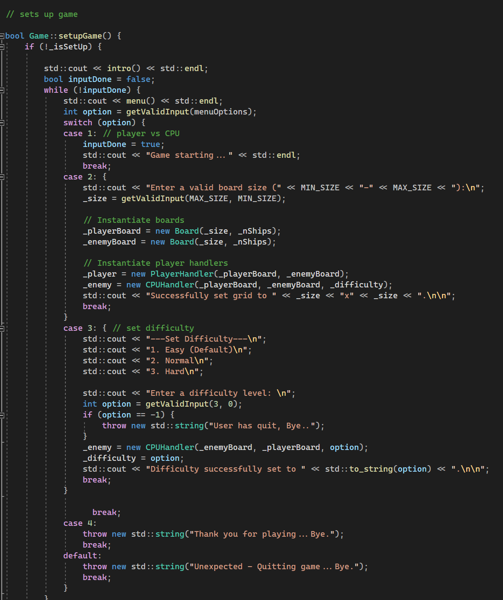

I designed a setupGame method with a switch statement that has the potential to be expanded and eventually provide many more customisations options.
If the user selects case '2', they are given the range of valid dimensions and are able to set the board to a valid size to then play on. I also added appropriate error handling to only allow values
within the acceptable range. This is currently limited to 25 as a maximum because of difficulties with the X axis headers. I used the ASCII codes to define the column headers but this does not work
as I desired after 'Z'.

_**Setting CPU Difficulty**_

The above snippet also shows how I allowed the user to configure one of three difficulty levels:
1. Easy (100% random attacks)
2. Normal (50% Random & 50% Hard mode attacks)
3. Hard (100% hard mode attacks)

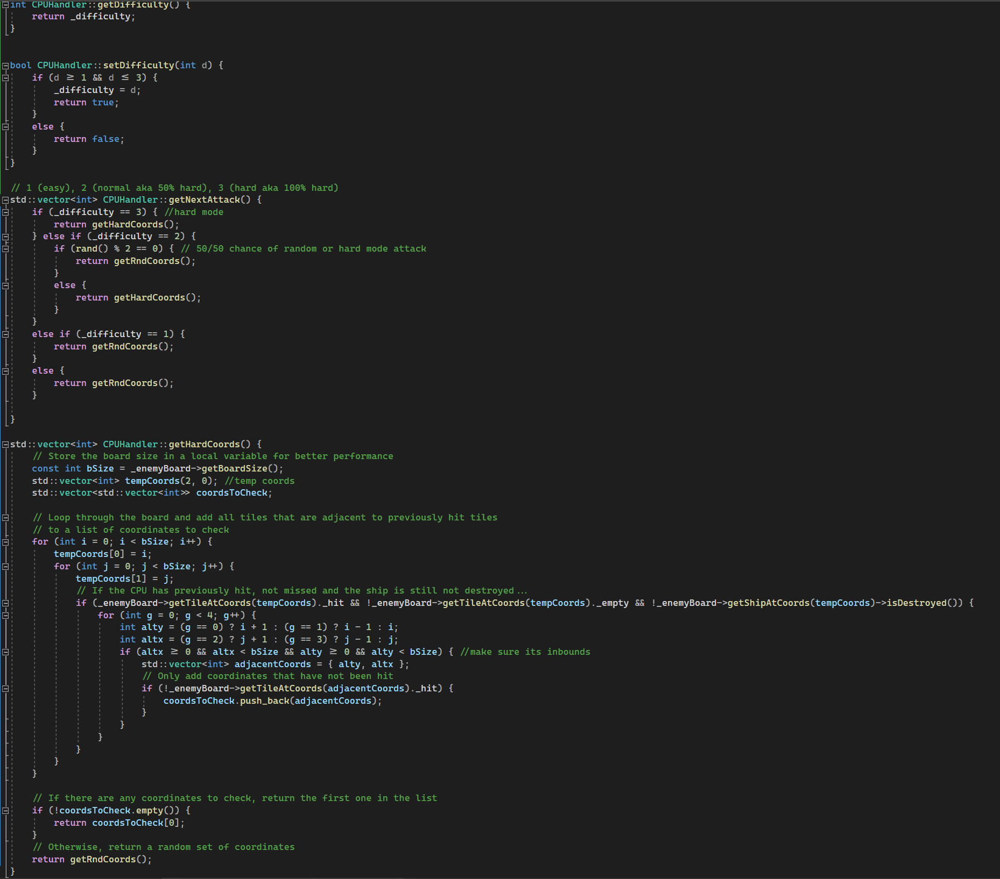

* setDifficulty() - sets the difficulty of the game as long as it is between 1 & 3
* getNextAttack()
    * if difficulty set to 3, CPU will use 'semi-intelligent' attacking (aka hard mode)
    * if difficulty set to 2, 50/50 chance of hard mode or random attacks
    * if difficulty set to 1, completely random attacks

The getHardCoords() method returns the coordinates of a hard attack for the computer player. It does this by first creating a list of coordinates that are adjacent to tiles that the computer player has previously hit.
If there are any coordinates in this list, the function returns the first one. If the list is empty, the function returns a random set of coordinates instead.

## Summary

>Pros:

* It seemed daunting at first but, after decomposing the challenge into smaller epics and manageable stories I was able to tackle it using an agile approach.
* Regularity and thoroughness in testing allowed for a good level of robustness within my code.
* OOP approach allowed for greater code use
* Very modular structure and good separation of concerns - e.g., each class was separated into its own file.
* Use of advanced techniques: State Machine Pattern, abstraction, inheritance

> To improve

As well as the already mentioned improvements, there are a number of things I could improve in future:
* Some logic is overly complex and inefficient
    * e.g., getHardCoords() method in CPUHandler.cpp used a nested loop to iterate through the entire game board and check each tile, which could potentially be inefficient if the board is large.
* Memory Management:
    * The Game class has member variables _playerBoard, _enemyBoard, _player, and _enemy which are dynamically allocated using new, but there is no corresponding delete statement to free up the memory when it is no longer needed. 
    This can lead to memory leaks. To fix this, I could have used smart pointers, such as std::unique_ptr, to manage the memory automatically.
* Exception Handling:
    * In some areas, the code uses raw pointers for exceptions and throws them as strings. However, it is generally a better practice to throw exceptions as objects, so that they can provide more information about the error and the context in which it occurred. 
    I could have created a custom exception class or use one of the standard exception classes in the std library, such as std::runtime_error or std::invalid_argument.
* Organisation:
    * The Game class has a large number of responsibilities, including handling user input, managing the game state, and interacting with other classes. It might have been a good idea to split up these responsibilities into smaller, more focused classes to make the code 
    more modular and easier to understand. For example, I could have created a separate class for managing the game menu and user input, and another class for managing the game loop and game state.
* Duplication: 
    * As per DRY principles, it is better to avoid code repetition. The setupGame function has a block of code that instantiates the _playerBoard, _enemyBoard, _player, and _enemy objects. This code is also present in the case 2 block of the switch statement. 
    It would be better to move this code out of the switch statement and into a separate function, so that it can be called from both places without duplication.
* I also wanted to develop the game further by adding more features
    * e.g., player v player
    * set number of ships
    * Salvo version
    * Hidden mine version

Overall, I thoroughly enjoyed this project and the opportunity to tackle some real challenges. In future, I will look to work on the aforementioned improvements and hopefully one day achieve a fully fledged Battleships game with all the bells and whistles.

Created by Mohammed Hussain
04/01/2023
